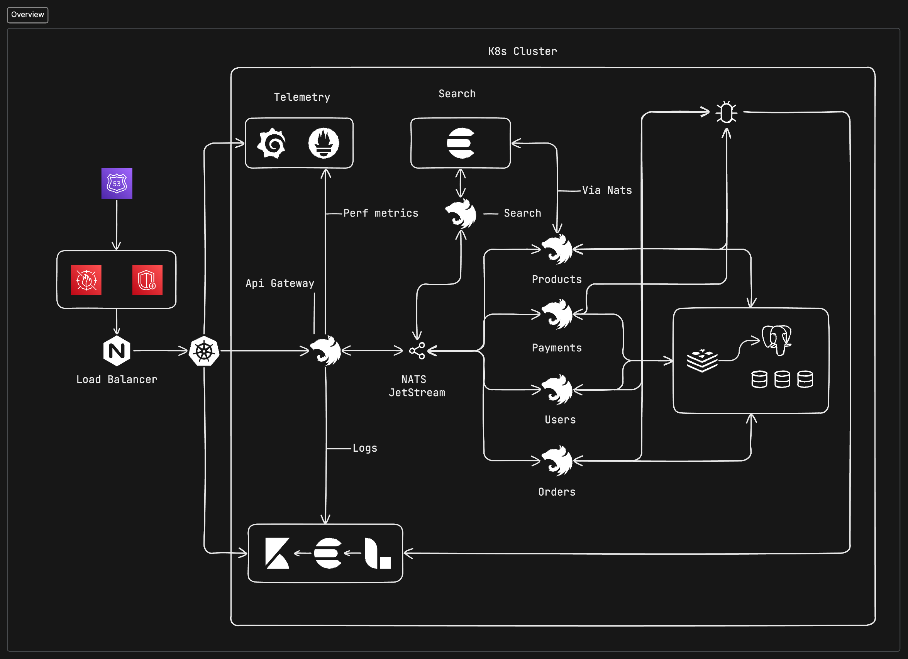

# Retail Microservices Architecture

## Introduction

This repository holds the infrastructure and service code for a retail microservices application, which is structured to demonstrate a scalable and distributed system akin to large-scale e-commerce platforms.

## Architecture Overview

The architecture is designed to be scalable, resilient, and secure, following best practices for cloud-native applications.

### Traffic Flow and Security

1. **AWS Route 53**:

   - Serves as the DNS service routing domain traffic to the appropriate resources.
   - Includes health checks to ensure traffic is only routed to healthy endpoints.

2. **AWS WAF and Shield**:

   - **AWS WAF** is applied at the edge of the network, protecting the entry points such as the Application Load Balancer or Amazon API Gateway against common web exploits.
   - **AWS Shield** provides DDoS protection to safeguard the application from network and transport layer attacks.

3. **Nginx Load Balancer**:

   - Distributes incoming traffic across Kubernetes pods.
   - Can act as an SSL termination point, managing secure connections from clients.

4. **Kubernetes Cluster**:

   - Hosts and orchestrates all the microservices, handling deployment, scaling, and management.

5. **Microservices**:
   - **API Gateway**: Central entry point for all client HTTP requests, directing them to the appropriate services.
   - **Search Service**: Manages search operations within the platform.
   - **Products Service**: Maintains product listings and inventory.
   - **Orders Service**: Oversees the order lifecycle.
   - **Payments Service**: Processes financial transactions securely.
   - **Users/Auth Service**: Manages user authentication and profile data.

### Telemetry and Logging

- **Prometheus and Grafana**:
  - Prometheus collects and stores metrics, running on port `9090`.
  - Grafana, accessible on port `3002`, is used to visualize the metrics collected by Prometheus.
- **Logging**:
  - **Pino**: Integrated with NestJS for structured logging.
  - **GELF**: Transmits `stdout`/`stderr` output to Logstash.
  - **Logstash**: Processes logs and forwards them to Elasticsearch.
  - **Elasticsearch and Kibana**:
    - Elasticsearch indexes and stores logs.
    - Kibana, on the standard port, provides a user interface for log query and visualization.

## Database Schema

For local development, a single PostgreSQL instance is used to store data for all services. In a production environment, it is recommended to split databases per service for isolation and scalability.

## Local Setup

Instructions for local setup will be provided to run each service individually, along with steps to set up the entire ecosystem using Docker Compose or a local Kubernetes cluster.

## Project Status

The application is in the development stage and not yet ready for production deployment. Current configurations are optimized for local development and learning purposes.

## Security Measures

Security is a cornerstone of the architecture, with AWS WAF and Shield providing a strong defense against web attacks and DDoS. Internally, Kubernetes network policies, pod security policies, and TLS/SSL are used to ensure secure operations within the cluster.

## Contributing

We welcome contributions to this project. Please follow the project's code of conduct and submit pull requests for consideration.

## License

This project is licensed under the MIT License - see the [LICENSE](LICENSE) file for details.
